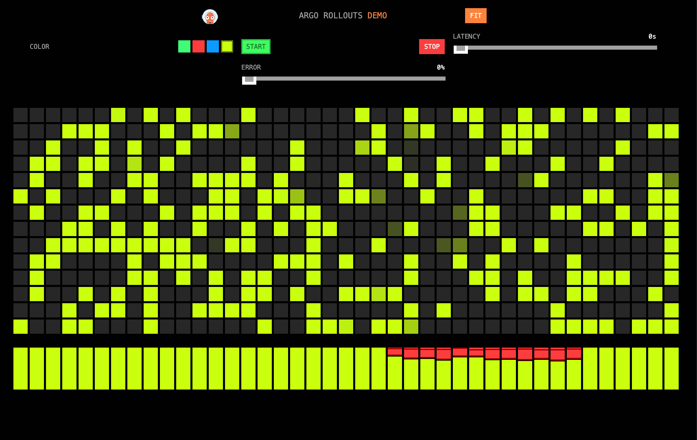

# Powering Progressive Deployment in Kubernetes

Recently, the Kubernetes community celebrated the platform's 10th year in existence. Inarguably, it has come a long way since its early days at Google and has established itself as the de-facto platform for delivering cloud-native modern applications.

In your application modernization journey, you have no doubt made use of containerization technology, automated your build and deployment pipelines with CI/CD tooling of GitOps solutions to handle your infrastructure in code as you already do your applications. With all the capabilities in Kubernetes, augmented by the rich ecosystem of related open-source tools and contingents, there are still inherent complexities that remain unsolved for you. For instance, you may find it relatively easy to set up your first production cluster, deploy your applications to it, and start accepting live traffic to it. But, how is it performing? What are users experiencing when they consume your applications and APIs? Do you have enough capacity for organic growth or seasonal surges related to your apps? When you inevitably need to update your application, how do you do so while minimizing disruption?

## Deployment Patterns

Fortunately, as software development itself has design patterns - repeatable blueprints for successfully and sustainably building applications, there also exist patterns for the deployment and operation of them. You may have heard of "Blue-green", "Canary deployments", and "A/B Testing. These are examples of deployment patterns; designed to route and shape application traffic over time. While these deployment patterns seem promising, until the last several years, you had been left to your own devices (no pun intended) to implement them. However, proxies such as NGINX, Envoy and service meshes such as Istio have been able to assist in the execution of these patterns as application rollout strategies. While these solutions fit neatly into a Kubernetes environment and can route and process traffic into the applications residing in the cluster, many of them have their own specific behaviors and differences in configuration.

Fortunately, the Kubernetes community recognized a flourishing of specific implementations to perform these functions natively. As a result, the Kubernetes [SIG-NETWORK](https://github.com/kubernetes/community/tree/master/sig-network) community released a common specification for modern application delivery services in Kubernetes called the Gateway API. Gateway API is an official Kubernetes project focused on L4 and L7 routing in Kubernetes. This project represents the next generation of Kubernetes Ingress, Load Balancing, and Service Mesh APIs. From the outset, it has been designed to be generic, expressive, and role-oriented.

The overall resource model focuses on 3 separate personas and corresponding resources that they are expected to manage:

")

We will dig into using some of these resources later in this article.

This new specification has been supported by a number of projects and vendors, most notably the NGINX Gateway Fabric for Kubernetes.
At KubeCon 2023, F5 NGINX [unveiled](https://www.f5.com/company/blog/nginx/watch-nginx-gateway-fabric-at-kubecon-north-america-2023) 1.0 of NGF, supporting traffic splitting patterns such as Canary and Blue-green intrinsically.


While the capability to execute these application rollouts in a vendor-neutral way has been a desire of the community, what about the observability considerations mentioned earlier? How can we be assured that our applications are working after deploying new versions? What if we want to orchestrate the progressive introduction of application changes rather than a "big-bang" deployment? And if the deployment isn't successful, how might we know if we need to roll back?

## Progressive Delivery

Progressive delivery has emerged as a preferred approach for modern applications for a number of reasons. It can be a means to orchestrate a gradual feature rollout for an application. It can help reduce risk by deploying changes only to a subset or test group of users first. You can also use progressive delivery to gather early feedback on a new application deployment and other use cases. This isn't meant to be an exhaustive list of use cases, but merely an introduction.

## A Solution

NGINX is the most widely used web server and application proxy in the world. It has been very popular in the Kubernetes world, as the de-facto Ingress controller for a number of years. With the aforementioned NGINX Gateway Fabric packaging, the ubiquitous API Gateway, load balancer and security enforcement solution has minted a new lease on seamless integration with Kubernetes.

How do we orchestrate progressive delivery? There is more we need...

Our friends at the Argo Project (famous for their GitOps platform, ArgoCD) released Argo Rollouts back in 2019, focused on this progressive delivery problem. Argo Rollouts enables the orchestration of Canary deployments, Blue-green deployments, and experimentation with traffic splitting.

")

However, the ability to execute the traffic shaping portion of application rollouts with popular proxies and service meshes required in-tree source code which added complexity, and slowed down contributions. As you might imagine, the amount of effort required to develop and maintain all these vendor and implementation-specific extensions has been a chore to say the least.

Fortunately, on April 5, 2023, the Argo Project [announced](https://blog.argoproj.io/argo-rollouts-1-5-release-candidate-2bd93720e411) that a plugin system for Argo Rollouts had been developed, enabling future extensibility of the product without friction to contributing described above. This was a welcome addition, and would set up the Argo Project for yet another important innovation...

To much celebration, the Argo Project [announced](https://blog.argoproj.io/argo-rollouts-now-supports-version-1-0-of-the-kubernetes-gateway-api-acc429729e42) on June 20, 2024 that Argo Rollouts now supports ingresses, gateways and service meshes that implement the Kubernetes Gateway API for progressive delivery. Unsurprisingly, NGINX Gateway Fabric, powered by the most popular proxy in the world, is one of the [supported providers](https://gateway-api.sigs.k8s.io/implementations/).

## Better Together

There are a number of benefits of using NGINX Gateway Fabric with Argo Rollouts:

- **Enhanced Traffic Management:** NGINX Gateway Fabric provides robust traffic management capabilities, allowing dynamic routing adjustments during deployments.
- **Increased Availability and Reliability:** This combination ensures high availability and reliability through intelligent traffic handling and failover mechanisms.
- **Improved User Experience:** Progressive delivery with NGINX Gateway Fabric and Argo Rollouts minimizes downtime and reduces the risk of introducing bugs or issues to end-users.
- **Efficient Rollback Mechanisms:** Ease of rolling back changes in case of issues, ensuring quick recovery and minimal impact on users.

## The Details

Without further ado, let's set this up for a test drive. You are going to need a Kubernetes cluster, ideally [version 1.25 or greater](https://github.com/nginxinc/nginx-gateway-fabric#technical-specifications) so we can take advantage of features in the latest version of the Gateway API. While the installation could be performed entirely by script or using something like Argo CD, we will be performing each step manually for learning purposes.

Here's the overall architecture of the demo environment:

TODO: Diagram here

> Note: It is inadvisable to perform the demo steps in a production Kubernetes cluster without prior validation in a lesser environment.

Local tools needed:

- [Helm](https://helm.sh/docs/intro/install/)
- [kubeconfig](https://kubernetes.io/docs/tasks/tools/#kubectl) (set up with a config valid for your test cluster)
- [git](https://git-scm.com/downloads)

We will begin by installing NGINX Gateway Fabric. We will be using the Plus edition to take advantage of its extended metrics and seamless configuration reload capabilities.

### Installation

1. Create the namespace for NGF:

    ```shell
    kubectl create namespace nginx-gateway
    ```

1. Create a Secret to pull the NGF container from the F5 private registry. The secret is based on the contents of the trial JWT from MyF5. If you do not have a trial JWT, you can request one [here](https://www.f5.com/trials/free-trial-connectivity-stack-kubernetes).

    ```shell
    kubectl create secret docker-registry nginx-plus-registry-secret --docker-server=private-registry.nginx.com --docker-username=`cat the_full_path_to_you_jwt_here` --docker-password=none -n nginx-gateway
    ```

1. The Kubernetes Gateway API isn't included in clusters by default. We need to install its Custom Resource Definitions (CRDs) in order to use it:

    ```shell
    kubectl kustomize "https://github.com/nginxinc/nginx-gateway-fabric/config/crd/gateway-api/standard?ref=v1.3.0" | kubectl apply -f -
    ```

1. Next, we will install NGF via its Helm chart:

    ```shell
    helm install ngf oci://ghcr.io/nginxinc/charts/nginx-gateway-fabric --set nginx.image.repository=private-registry.nginx.com/nginx-gateway-fabric/nginx-plus --set nginx.plus=true --set serviceAccount.imagePullSecret=nginx-plus-registry-secret -n nginx-gateway --version 1.3.0
    ```

1. Run the following command to wait until NGF has been verified as deployed:

    ```shell
    kubectl wait --timeout=5m -n nginx-gateway deployment/ngf-nginx-gateway-fabric --for=condition=Available
    ```

1. We will be using Prometheus metrics to inform Argo Rollouts of the state of our application's health during rollouts. Add the Prometheus community helm chart, then update the Helm repo:

    ```shell
    helm repo add prometheus-community https://prometheus-community.github.io/helm-charts
    helm repo update
    ```

1. Install Prometheus to your cluster in its own namespace:

    ```shell
    helm install prometheus prometheus-community/prometheus -n prometheus --create-namespace --set server.global.scrape_interval=15s
    ```

1. Create a namespace for Argo Rollouts, and install it using manifests from the project's GitHub repo:

    ```shell
    kubectl create namespace argo-rollouts
    kubectl apply -n argo-rollouts -f https://github.com/argoproj/argo-rollouts/releases/latest/download/install.yaml
    ```

1. Install the Argo Rollouts CLI using the [instructions](https://argoproj.github.io/argo-rollouts/installation/#kubectl-plugin-installation) for your client platform.

1. Install the Gateway API Plugin for Argo Rollouts:

    ```shell
    kubectl apply -f gateway-plugin.yml -n argo-rollouts
    ```

1. Restart the Argo Rollouts controller so that it detects the presence of the plugin.

    ```shell
    kubectl rollout restart deployment -n argo-rollouts argo-rollouts
    ```

1. Then, check the controller logs. You should see a line for loading the plugin:

    ```shell
    time="XXX" level=info msg="Downloading plugin argoproj-labs/gatewayAPI from: https://github.com/argoproj-labs/rollouts-plugin-trafficrouter-gatewayapi/releases/download/v0.2.0/gateway-api-plugin-linux-amd64"
    time="YYY" level=info msg="Download complete, it took 7.792426599s"
    ```

### Demo Setup

Now that our cluster services are in place, we will now use NGF and Argo Rollouts to perform a Canary deployment from a [fork](https://github.com/aknot242/rollouts-demo) of the [Argo Rollouts demo application](https://github.com/argoproj/rollouts-demo). This type of deployment assumes we will start with a known good or "stable" deployment into our cluster. Once this is deployed, we can update the deployment to introduce new versions of an applications pods in a gradual manner. I will highlight how this works along the way.

1. With git, clone the demo repo:

    ```shell
    git clone https://github.com/aknot242/rollouts-demo.git
    ```

1. Change directory to your repo clone's `nginx-gateway-fabric` directory:

    ```shell
    cd rollouts-demo/examples/nginx-gateway-fabric
    ```

1. Apply the `Gateway` manifest:

    ```shell
    kubectl apply -f gateway.yaml
    ```

    > Note: This is a resource that has been added by the Kubernetes Gateway API, and will be used by NGF to accept requests coming into the cluster.

    > Note: This and all additional resources are deployed into the default namespace. If you need to install into a different namespace, add `-n namespace_name_here` to each of the kubectl commands.

1. Apply the `HTTPRoute` manifest:

    ```shell
    kubectl apply -f httproute.yaml
    ```

    > Note: This resource was *also* added by the Kubernetes Gateway API. This resource will reference the `Gateway` object, and contains layer 7 routing rules to direct the traffic to the configured Kubernetes services.

1. Next, deploy two services: a service to represent the "stable" version of our application, and one to represent our "canary" version:

    ```shell
    kubectl apply -f stable-service.yaml
    kubectl apply -f canary-service.yaml
    ```

1. Now we will deploy the `AnalysisTemplate` resource, provided by Argo Rollouts. This resource contains the rules to assess a deployment's health, and how to interpret this data. In this demo, we will be using Prometheus query to examine the canary service's upstream pods for the absence of 4xx and 5xx HTTP response codes as an indication of its health.

    ```shell
    kubectl apply -f analysis-success-rate.yaml
    ```

1. Finally, deploy the app itself. This step introduces the `Rollout` resource, provided by Argo Rollouts. This resource is simply an extension of the familiar `Deployment` resource, but contains additional objects to instruct Argo Rollouts in how to deploy subsequent versions of this application, while monitoring their health.

    ```shell
    kubectl apply -f rollout.yaml
    ```

1. Use `kubectl` to verify that there are 5 replicas of the application running:

    ```shell
    kubectl get pods
    ```

### Monitoring the Stable Rollout

1. Now that the application is fully deployed, use Argo Rollouts' `kubectl` plugin to observe the initial state of the application. Open a new shell window, and run the following:

    ```shell
    kubectl argo rollouts get rollout rollouts-demo -w
    ```

    > Note: Leave this running in its own window, as we will use it through the rest of the demo.

    You should see the following:

    

    In the image above, you will observe several things (in no particular order):

    - The rollout of the "stable" version of the application was successful, with 5 replicas of the `rollouts-demo:blue` image created.
    - There are 8 steps to this progressive rollout. Refer to the `rollout.yaml` file to see the configured stages.
    - You should see that the rollout is `Progressing`, awaiting a canary rollout.

1. Open a new shell window, and set up a port forward to the NGF pod's NGINX container:

    ```shell
    NGINX_POD=`kubectl get pods --selector=app.kubernetes.io/name=nginx-gateway-fabric -n nginx-gateway -o=name`
    kubectl port-forward $NGINX_POD -n nginx-gateway 8080:80
    ```

    > Note: In a production scenario, we would not have used a port forward. Rather, we would have likely used a `Service` type `LoadBalancer` to reach the NGF instance. However, this requires additional setup, and varies greatly depending on where your cluster is hosted.

1. Open a browser to `http://localhost:8080`. You will be presented with the demo application:

    

    > Note: In the grid, each blue square represents a connection being made through NGF to one of the demo pods hosted in the rollout deployment. Since we are using the `rollouts-demo:blue` image, the service responds with that color. The area at the bottom represents the portion of responses by a particular color over time.

    > Important: Certain browsers like Chrome will put a tab to sleep if the tab is not the actively selected one. As a result, if you switch to another tab, the HTTP calls to the demo app will cease until the tab has been activated once again.

### Initiating a Canary Rollout

Now that we have a stable version of our rollout running, we need to introduce an application change. The demo project contains different variants of the color-producing services, so we'll leverage these so you can easily see what is going on. To update the deployment, you can either update the `rollout.yaml` file to use a different image, or use the Argo Rollouts CLI. We'll do the latter.

1. In the original shell window you opened, use the CLI to start a Canary rollout of the `rollouts-demo:yellow` image:

    ```shell
    kubectl argo rollouts set image rollouts-demo "*=argoproj/rollouts-demo:yellow"
    ```

1. Switch to the shell window that is monitoring the rollout status. You should see something similar to the following:

    

    > Note: The canary rollout has begun, and has paused at the 30% traffic stage, as directed by the rollout rules in `rollout.yaml`.

1. Switch back to your browser and you should see something similar to this:

    

1. Switch back to the rollout status shell window.

    

    > Note: The AnalysisRun is continually running. Why? Since this canary rollout has only *partially* progressed, Argo Rollouts continues to monitor the results of the Prometheus query configured in the AnalysisTemplate resource (in `analysis-success-rate.yaml`) to ensure there are no 4xx-5xx HTTP errors present in the NGINX upstream metrics produced for this canary service. This analysis template is configured to run every minute. This rollout has a rule set to pause indefinitely at 30% traffic. How do we complete the rollout?

1. Switch to your original shell and run the following to continue (or, "promote") the rollout:

    ```shell
    kubectl argo rollouts promote rollouts-demo
    ```

    > Note: In the shell window that the kubectl rollouts plugin is running, you will see the rollout progress over the next several minutes - gradually shifting traffic over to the canary service represented in the demo app. Once complete, the canary service will become the new stable release.

1. Once the rollout completes, you should see that the ui of the demo application has shifted entirely over to using the yellow service.

    

1. Switch to the kubectl rollouts plugin window. You will notice that there are 2 replicasets with 5 pods each - one representing the new stable release, and another representing the previous release. Since all the traffic is being routed to the new stable release, why do we need to keep the previous pods around? If it were determined that there is an undetected issue with the stable release, you can switch back to the previous revision of the application without having to wait for new pods to initialize first.

    

### Simulate a Failed Rollout

We have just seen what an ideal rollout looks like. What about a rollout where failures are detected by the AnalysisTemplate based on Prometheus metrics? We will deploy a new Canary version of this app by selecting an image that intentionally throws HTTP errors.

1. In the original shell window you opened, use the CLI to start a Canary rollout of the `rollouts-demo:bad-red` image:

    ```shell
    kubectl argo rollouts set image rollouts-demo "*=argoproj/rollouts-demo:bad-red"
    ```

1. Switch back to your browser and you should see something similar to this

    

1. Wait at least a minute, and you should see something like this:

    

    > Note: You will see a portion of red service responses for about a minute, then reverts back to 100% green. Why? Look at the kubectl argo rollouts plugin to see what is going on. You may observe that the AnalysisRun has failed at least one time, triggering Argo Rollouts to perform an automaticc rollback to the last successful rollout version. Cool, right?

    

## Conclusion

This was only a taste of what can be accomplished with Argo Rollouts and NGINX Gateway Fabric. However, I hope you have been able to witness the benefits of adopting progressive delivery patters using tools such as these. I would encourage you to further explore what you are able to accomplish in your own environments.
